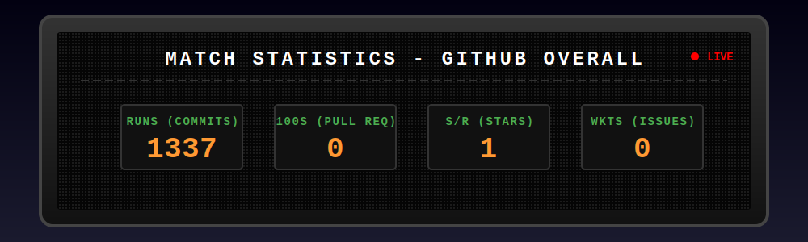
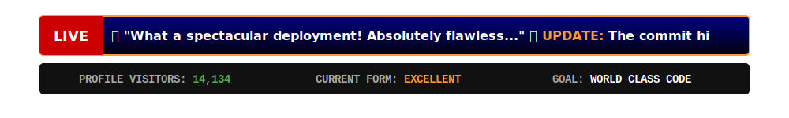

<!-- 
  Hi! This README is generated automatically by a script.
  To customize the template, edit the files in the svg-templates/ folder.
-->

# 🏏 The Interactive Cricket GitHub Profile 🏏
 

 

 

 

 

 

 

### How this profile works:
This README is updated daily via a [GitHub Action](./.github/workflows/update-readme.yml) that fetches my latest GitHub stats and dynamically injects them into custom-designed pixel art SVG templates! 

*Theme: Retro Cricket World Cup (Team India Edition)* 🇮🇳

